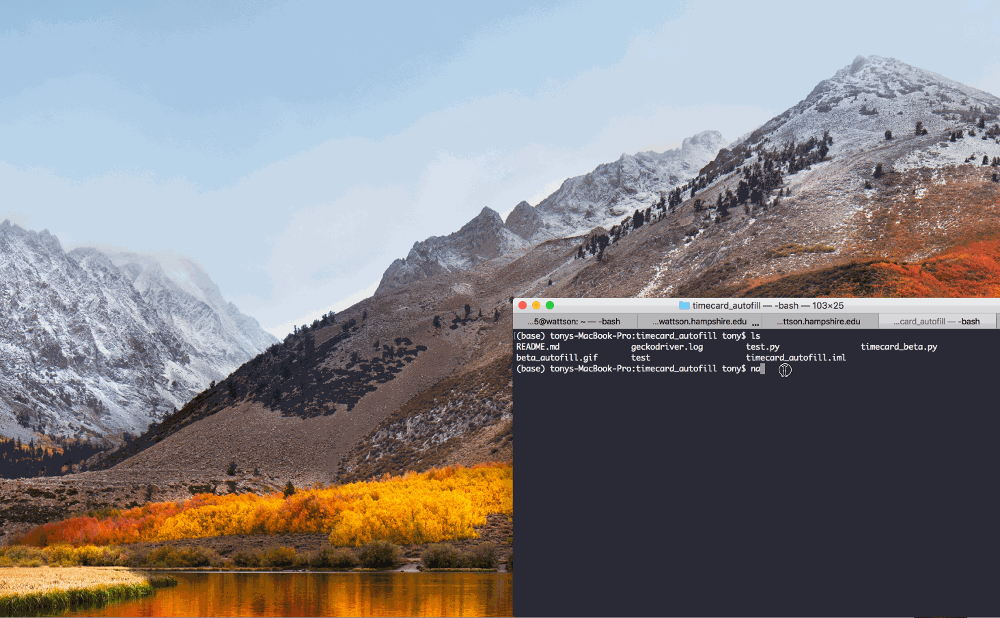

# Autofiller

Autofiller is an autofill program which helps you fill payroll time 
card bi-weekly. It's still the alpha version but working.  


### User Stories


- [x] User can enter a day of the week and one time slot of that day so that the program will fill that one slot for the user.
- [x] User can enter multiple days and slots at the same time.
- [ ] User can switch between different browsers.
- [ ] User can choose between different jobs
- [ ] User can give extra parameter to determine if they want to submit for final. 
### App Walkthough GIF



### How to use


1. Make sure you have a working python on you computer. Both Python 2 and Python 3 will work.
2. Use pip to install selenium. You also need a webdriver so that the python can interact with your web browser. Right now, the only working one is Chrome. Go to the link below for more info. https://selenium-python.readthedocs.io/installation.html
3. Open the timecard_beta.py file. Fill out the user name and work_list in Be careful, you have to type the exact 
format which I provided in the file. capital AM or PM, zero padding for time.
4. Open your terminal type 
```
python timecard_beta.py
```
5. You should see a web window pop up and python will take care of the rest job. By default, the submit option is: "Save and I will go back", if you can finial check before you submit it.
6. Enjoy!

